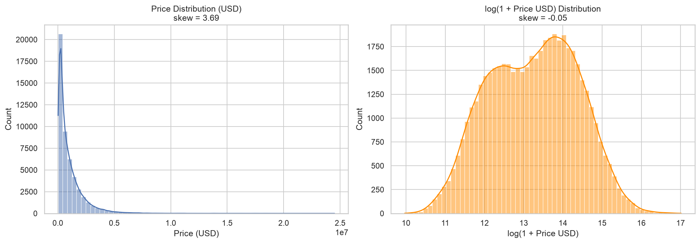
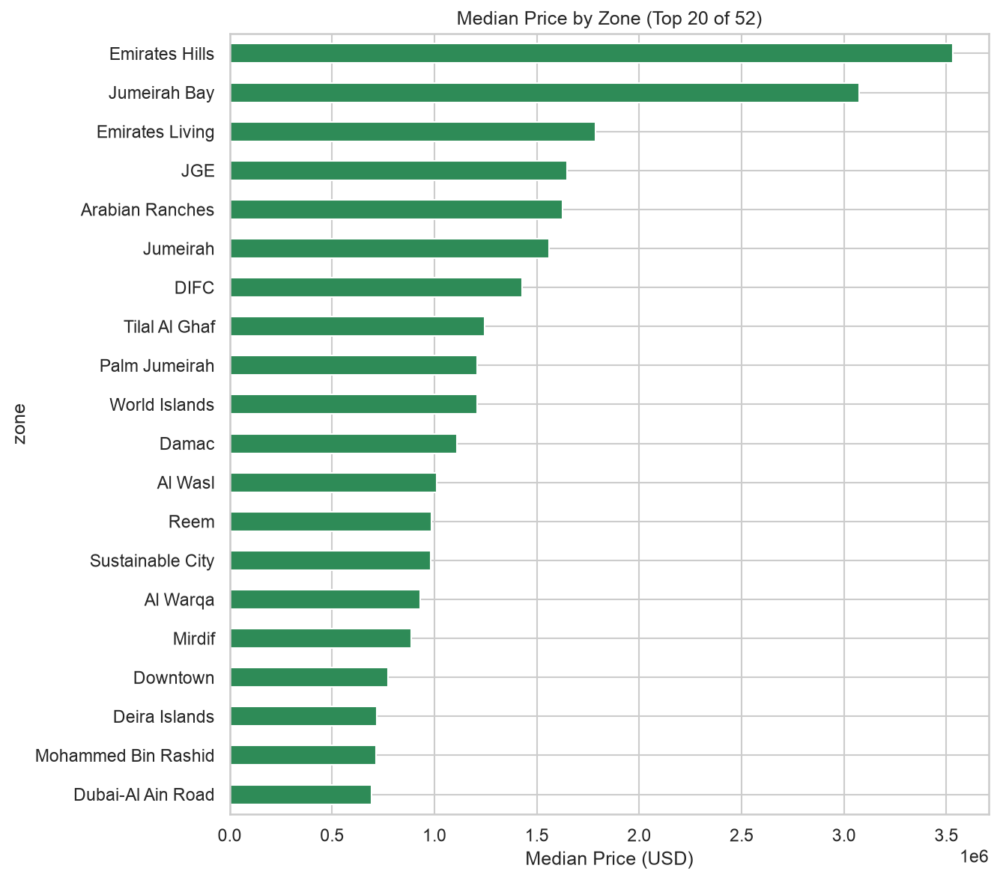
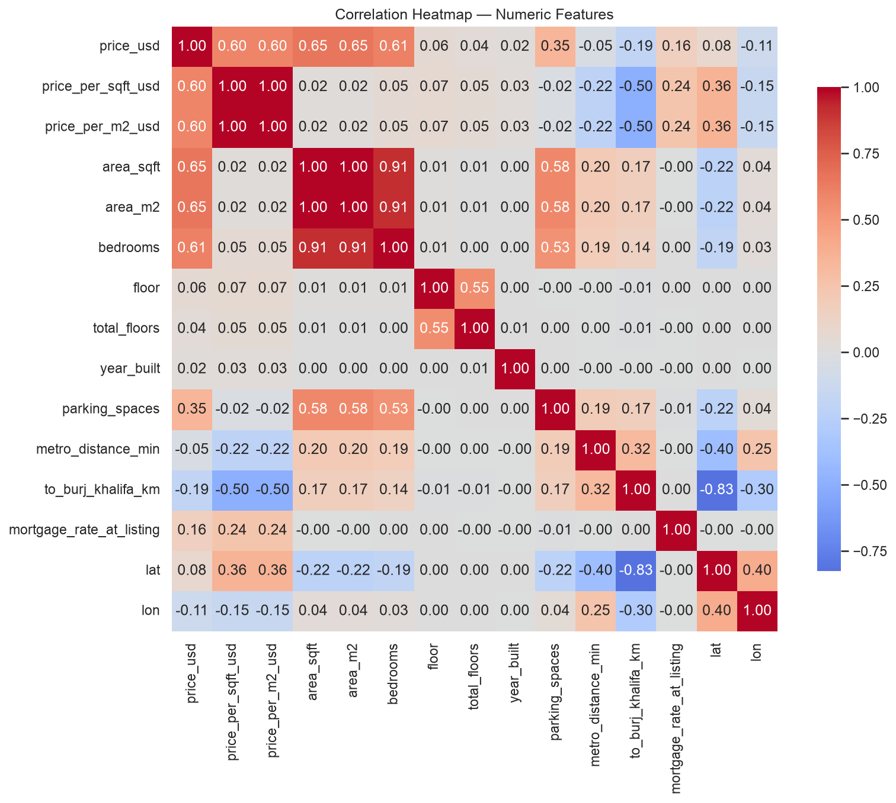
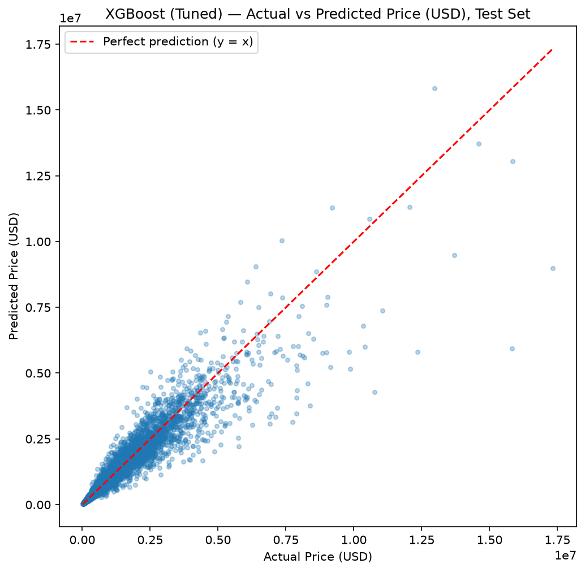
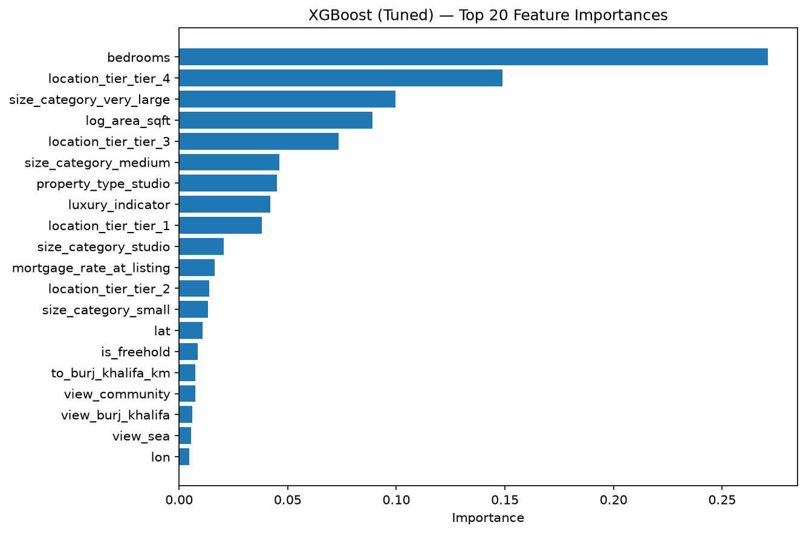

# Predicting Dubai Residential Property Prices Using Machine Learning

An end-to-end regression pipeline trained on 50,000 Dubai secondary-market property listings — from raw data to a tuned, persisted model with documented, leakage-safe preprocessing.

## Project Overview

This project predicts the listed sale price (in USD) of a residential property in Dubai from its physical characteristics, location, and listing attributes. Property price prediction matters to three groups directly: a buyer wants to know if a listing is fairly priced, a seller wants to know what to list at, and an agent wants to identify under- or over-priced inventory. The pipeline covers data cleaning, exploratory analysis, leakage-aware feature engineering, and a three-way model comparison (Linear Regression, Random Forest, XGBoost), with the best model tuned via cross-validated hyperparameter search. The final tuned XGBoost model explains 88.8% of price variance on held-out data (R² = 0.888) and predicts within roughly ±$162,554 on average (MAE) — a large improvement over a naive "always predict the average price" baseline, detailed below.

## Key Results

**Best model: XGBoost (tuned)** — Test R² = **0.888**, Test RMSE = **$403,817**, Test MAE = **$162,554**, 5-fold CV R² = **0.878 ± 0.008**.

| Model | Train R² | Test R² | Test RMSE (USD) | Test MAE (USD) |
|---|---|---|---|---|
| Baseline (predict mean) | 0.000 | -0.000 | $1,206,741 | $809,911 |
| Linear Regression | 0.819 | 0.834 | $491,101 | $210,191 |
| Random Forest | 0.971 | 0.849 | $468,818 | $191,514 |
| XGBoost (untuned) | 0.939 | 0.884 | $411,465 | $167,670 |
| **XGBoost (tuned)** | **0.913** | **0.888** | **$403,817** | **$162,554** |

Every trained model clears the baseline by a wide margin. Random Forest shows the largest train/test gap of the three ML models (0.971 → 0.849), a sign of overfitting; XGBoost generalizes better and was selected as the final model — see [Methodology](#methodology) for why.

**A note on currency:** all prices in this project are reported in **USD**, matching the source dataset. No currency conversion happens anywhere in the cleaning, EDA, or modeling pipeline — see [`docs/decisions.md`](docs/decisions.md) for the full reasoning. An AED conversion, if ever needed for a UAE-facing audience, would be applied only at the display/business-framing layer, never inside the model.

## Visualizations

**Target variable distribution** — raw `price_usd` is heavily right-skewed (skew 3.69); a `log1p` transform normalizes it almost completely (skew -0.05), which motivated training all three ML models on the log-transformed target.



**Median price by zone** — location is the single largest categorical price driver in this dataset, with a ~30x spread between the most and least expensive zones.



**Correlation heatmap** — `price_per_sqft_usd` and `price_per_m2_usd` correlate with price only because they are algebraically derived from it (leakage, excluded from modeling); among genuine features, `area_sqft`/`area_m2` and `bedrooms` correlate most strongly with price.



**Actual vs. predicted price (tuned XGBoost, test set)** — predictions cluster tightly around the perfect-prediction line for typical-range properties, with growing spread at the ultra-luxury end, where far fewer training examples exist.



**Feature importance (tuned XGBoost)** — `bedrooms` is the single strongest individual predictor, followed by the top price-tier location bucket and the largest size band.



## Business Problem

Real estate pricing in a fast-moving market like Dubai's is often set by comparison to similar recent listings rather than a systematic model, which leaves room for both buyers and sellers to misjudge fair value. A price-prediction model gives three concrete use cases:

- **Buyers** can check whether a listing is priced above what comparable properties suggest, before making an offer.
- **Sellers** can get a data-driven starting price instead of relying solely on an agent's comparison-based estimate.
- **Agents/brokerages** can flag under-priced inventory across a large portfolio of listings faster than manual review allows.

Framed as a product: *"a model that identifies mispriced Dubai properties by comparing predicted fair market value against listed price."*

## Dataset Description

- **Source:** [Kaggle — Dubai Real Estate: Sales & Rentals (2020–2026)](https://www.kaggle.com/datasets/sergionefedov/dubai-real-estate-sales-and-rentals-20202026) by sergionefedov, licensed Apache-2.0.
- **File used:** `secondary_sales.csv` only. The source dataset ships five files; `rentals.csv` and `off_plan.csv` are out of scope for this first model version, and `area_prices_monthly.csv` / `metro_stations.csv` are reserved as potential future enrichment sources (not used here).
- **Rows / columns:** 50,000 rows × 29 columns (raw).
- **Target variable:** `price_usd` — the listed sale price in USD.
- **Downloaded:** via the Kaggle API (`kaggle datasets download`), 2026-07-31.

| Column | Type | Description |
|---|---|---|
| `price_usd` | int (target) | Listed sale price in USD |
| `community` / `zone` | categorical | Neighbourhood (84 values) / broader area grouping (52 values) |
| `property_category` | categorical | `apartment` or `villa` |
| `property_type` | categorical | Fine-grained type (`studio`, `1BR`…`6BR_villa`, `4BR_penthouse`) |
| `bedrooms` | int | Bedroom count, 0 (studio) – 6 |
| `area_sqft` / `area_m2` | int / float | Unit size in two units (redundant conversion of each other) |
| `floor` / `total_floors` | float | Floor number / building height — **populated for apartments only**; structurally absent for villas |
| `year_built` | int | Construction year (only 6 distinct values in this dataset) |
| `view` | categorical | community, park, city, pool, sea, marina, golf_course, burj_khalifa |
| `furnishing` | categorical | unfurnished, semi_furnished, fully_furnished |
| `condition` | categorical | vacant_on_transfer, tenanted, off_plan_resale |
| `parking_spaces` | int | 1–4 |
| `is_freehold` / `chiller_included` | boolean | Ownership type / whether AC chiller cost is bundled |
| `metro_line` / `metro_distance_min` / `metro_distance_type` | categorical / int / categorical | Nearest metro line, minutes away, walk or drive |
| `to_burj_khalifa_km` | float | Distance to Burj Khalifa, a centrality proxy |
| `mortgage_rate_at_listing` | float | Prevailing mortgage rate at time of listing (macro variable, 7 distinct values) |
| `date_listed` | date | Listing date, 2020-01-01 to 2026-04-29 |
| `price_per_sqft_usd` / `price_per_m2_usd` | int | **Excluded from modeling** — deterministically derived from `price_usd`, i.e. leakage |

**A note on this dataset's authenticity:** cleaning and EDA both surfaced evidence this dataset is likely synthetically generated rather than scraped from a live listings site — zero duplicate rows, zero string-formatting issues, perfectly consistent derived columns, only 6 discrete `year_built` values, and a zone-price hierarchy that doesn't fully mirror the real Dubai market (e.g. Palm Jumeirah ranks below less iconic zones here). This is documented rather than hidden — see [`docs/data_cleaning_report.md`](docs/data_cleaning_report.md) — and is treated as a stated limitation throughout, not as evidence the model generalizes to the real Dubai market.

## Technology Stack

| Tool | Why it was chosen |
|---|---|
| **Python 3.11** | Standard for the ML ecosystem used here; type hints supported throughout `src/`. |
| **pandas / numpy** | Data loading, cleaning, and feature engineering on a 50,000-row tabular dataset. |
| **scikit-learn** | `Pipeline` / `ColumnTransformer` for leakage-safe preprocessing, plus Linear Regression, Random Forest, `RandomizedSearchCV`, and cross-validation utilities. |
| **XGBoost** | Gradient-boosted trees; typically the strongest off-the-shelf performer on structured/tabular data of this size, confirmed as the best model here. |
| **matplotlib / seaborn** | All EDA and evaluation visualizations. |
| **Jupyter / JupyterLab** | Notebooks are the deliverable format for this project — markdown-documented, reproducible top-to-bottom. |
| **joblib** | Persisting the final fitted pipeline (preprocessing + model) as a single loadable file. |
| **SHAP** | Installed for future explainability work (see [Future Improvements](#future-improvements)); not yet used in the current modeling notebook. |

## Installation and Usage

**Quick start** (from the repository root):

```bash
python3 -m venv venv && source venv/bin/activate
pip install -r requirements.txt
jupyter lab
```

**Full setup:**

1. **Clone the repository and set up the environment:**
   ```bash
   git clone <repository-url>
   cd ml-prediction-pipeline
   python3 -m venv venv
   source venv/bin/activate
   pip install -r requirements.txt
   ```
   On macOS, XGBoost additionally requires the OpenMP runtime: `brew install libomp`.

2. **Get the dataset** (not committed to this repository — see `.gitignore`):
   - Create a Kaggle API token at [kaggle.com/settings](https://www.kaggle.com/settings) → "Create New Token", and place it per the [Kaggle API docs](https://www.kaggle.com/docs/api).
   - Download and place the raw file:
     ```bash
     kaggle datasets download sergionefedov/dubai-real-estate-sales-and-rentals-20202026 -p data/raw/ --unzip
     ```
   - This project uses **only** `data/raw/secondary_sales.csv`. The other four files downloaded alongside it (`rentals.csv`, `off_plan.csv`, `area_prices_monthly.csv`, `metro_stations.csv`) are not required.

3. **Run the notebooks in order** (each expects the previous notebook's output to exist):
   ```bash
   jupyter lab
   # 01_data_cleaning.ipynb  -> writes data/processed/clean_secondary_sales.csv
   # 02_eda.ipynb            -> reads the clean CSV, exports 3 images
   # 03_modeling.ipynb       -> trains/tunes models, exports 2 images, saves models/best_model_xgboost.joblib
   ```
   Each notebook is written to run top-to-bottom without manual intervention (verified via `jupyter nbconvert --execute` after a fresh kernel restart).

4. **Use the saved model directly** (after running `03_modeling.ipynb` once):
   ```python
   import joblib
   model = joblib.load("models/best_model_xgboost.joblib")
   predicted_price = model.predict(a_dataframe_with_one_or_more_properties)
   ```
   The saved object is the complete pipeline (imputation, scaling, encoding, location-tier mapping, and the log-target transform) — no separate preprocessing code is needed at prediction time.

## Repository Structure

```
ml-prediction-pipeline/
│
├── README.md                          # This file
├── LICENSE                            # MIT license
├── requirements.txt                   # Exact package versions for reproducibility
├── .gitignore                         # Excludes data/, models/, __pycache__
├── PROJECT_SPECIFICATION.md           # Original project blueprint
│
├── notebooks/
│   ├── 01_data_cleaning.ipynb         # Raw data -> clean data
│   ├── 02_eda.ipynb                   # Clean data -> insights and visualizations
│   └── 03_modeling.ipynb              # Features -> trained models -> evaluation
│
├── src/
│   ├── __init__.py
│   ├── preprocessing.py               # Cleaning/validation functions (used in 01)
│   ├── feature_engineering.py         # Feature creation, incl. leakage-safe LocationTierEncoder
│   └── evaluate.py                    # Metric calculation and plotting functions (used in 03)
│
├── docs/
│   ├── data_cleaning_report.md        # Full write-up of every cleaning decision
│   └── decisions.md                   # Project decisions log (e.g. USD currency handling)
│
├── data/                              # Gitignored — not committed
│   ├── raw/                           # Original downloaded data (place secondary_sales.csv here)
│   └── processed/                     # Cleaned/feature-engineered data
│
├── models/                            # Gitignored — not committed
│   └── best_model_xgboost.joblib      # Produced by 03_modeling.ipynb
│
└── images/                            # Exported charts, embedded above
    ├── target_price_distribution.png
    ├── median_price_by_zone.png
    ├── correlation_heatmap.png
    ├── actual_vs_predicted.png
    └── feature_importance.png
```

## Methodology

**1. Data cleaning** (`01_data_cleaning.ipynb`, full detail in [`docs/data_cleaning_report.md`](docs/data_cleaning_report.md)): the raw dataset turned out to be unusually clean — zero duplicate rows, zero string-formatting issues, and internally consistent derived columns. The only real decision was **`floor`/`total_floors` missingness (35.64% of rows)**, which is 100% explained by `property_category == 'villa'` — villas structurally have no floor number. This was preserved as `NaN` rather than imputed with zero or a median, since either would fabricate information that doesn't exist for a standalone house.

**2. Exploratory data analysis** (`02_eda.ipynb`): analyzed the target first (right-skewed, skew 3.69, normalized by `log1p` to -0.05), then categorical and numeric features individually, then relationships. Two blueprint-expected columns — `bathrooms` and `developer`/`building` — do not exist anywhere in this dataset and are documented as unavailable rather than approximated.

**3. Feature engineering — leakage prevention was the central design constraint** (`src/feature_engineering.py`):
- `price_per_sqft_usd` and `price_per_m2_usd` are **excluded from every model's feature set** — both are deterministically derived from `price_usd` (confirmed in cleaning: `price_per_sqft_usd ≈ price_usd / area_sqft` to within rounding), so using either would let a model trivially reconstruct the target instead of learning genuine relationships.
- A `luxury_indicator` feature was deliberately built from **structural attributes only** (property type, bedroom count, size band) rather than a price-per-sqft threshold, since the latter would itself be leakage.
- The most subtle leakage risk in this project was **`location_tier`** — a feature grouping zones by their historical median price. Computing that grouping once from the full dataset (or even once from the training set before cross-validation) would leak target information into a feature. It's implemented as a custom scikit-learn transformer (`LocationTierEncoder`) that lives inside the modeling `Pipeline`, so scikit-learn fits it on the training fold only and applies it to the held-out fold automatically — including during `cross_val_score` and `RandomizedSearchCV`, where a manually precomputed column would otherwise leak validation-fold prices across folds. This was verified with a standalone integration test before being used in the final notebook.

**4. Train/test split:** 80/20, `RANDOM_STATE = 42`, performed **before** any scaling, encoding, or transformer fitting — the split happens on the statically-engineered dataframe, and the `ColumnTransformer` (imputation, scaling, one-hot encoding, location-tier encoding) is fit only on the training fold.

**5. Baseline and models:** a `DummyRegressor(strategy="mean")` establishes the floor every real model must beat. Linear Regression, Random Forest, and XGBoost were then trained with **identical** preprocessing and the same train/test split, each via `TransformedTargetRegressor` trained on `log1p(price_usd)` (motivated by the EDA skew finding) and evaluated back on the original USD scale.

**Why XGBoost was selected:** among the three untuned models, XGBoost had both the best test R² (0.884) *and* a smaller train/test gap (0.939 → 0.884) than Random Forest (0.971 → 0.849) — meaning its strong performance reflects learned patterns rather than memorized training noise. Only XGBoost was then tuned (`RandomizedSearchCV`, 30 parameter combinations, 5-fold CV on a fixed `KFold` shared across every CV call in the notebook for a fair comparison), improving test R² to 0.888 and CV R² to 0.878 ± 0.008.

## Model Results

| Model | Train R² | Test R² | Test RMSE (USD) | Test MAE (USD) | CV R² (mean ± std) |
|---|---|---|---|---|---|
| Baseline (mean) | 0.000 | -0.000 | $1,206,741 | $809,911 | — |
| Linear Regression | 0.819 | 0.834 | $491,101 | $210,191 | 0.818 ± 0.007 |
| Random Forest | 0.971 | 0.849 | $468,818 | $191,514 | 0.838 ± 0.011 |
| XGBoost (untuned) | 0.939 | 0.884 | $411,465 | $167,670 | 0.867 ± 0.012 |
| **XGBoost (tuned)** | **0.913** | **0.888** | **$403,817** | **$162,554** | **0.878 ± 0.008** |

*Tuned hyperparameters: `n_estimators=500`, `max_depth=5`, `learning_rate=0.05`, `subsample=0.6`, `colsample_bytree=0.8`, `min_child_weight=5`.*

Train and test R² are both reported for every model, per standard practice — reporting test performance alone would hide Random Forest's overfitting. Cross-validation standard deviations are small (≤0.012 for all models), indicating the reported metrics reflect a stable model, not a lucky train/test split.

## Key Findings

1. **Location produces a ~30x price spread** across zones (median $115,250 in the cheapest zone vs. $3,530,400 in the most expensive), making it the single largest categorical price driver identified in EDA.
2. **Property type produces a ~21x spread** independent of location (studio $125,250 → 6-bedroom villa $2,614,200 median).
3. **Villas price far above apartments overall** (median $1,404,650 vs. $305,050), and this gap holds consistently within every major zone — location and property-category effects are additive, not confounded.
4. **Bedroom count is the single strongest individual feature in the final model** (importance 0.271) — but it's not a clean linear driver: 4-bedroom apartments (all `4BR_penthouse`) slightly *out-price* 4-bedroom villas, because that specific apartment sub-type is an ultra-premium segment.
5. **Floor position shows almost no relationship with price** (correlation ~0.04–0.06), counter to common real-world intuition about height/view premiums — a pattern that, combined with finding 8 below, points to this dataset simplifying some real-world price drivers.
6. **View type carries a real premium:** sea-view listings price more than 2.5x above community-view listings.
7. **`price_per_sqft_usd`/`price_per_m2_usd` correlations with price (~0.60) are not genuine relationships** — they're algebraic restatements of the target and were excluded from every model.
8. **Zone-level price rankings don't fully mirror real-world Dubai submarket hierarchies** (e.g. Palm Jumeirah ranks below Emirates Hills and Jumeirah Bay here) — a limitation stated explicitly rather than implied to reflect the real market.
9. **Every trained model comfortably beats the naive baseline**, but Random Forest overfits more than XGBoost (a 0.122 train/test R² gap vs. XGBoost's 0.055 gap pre-tuning), which is why XGBoost — not the model with the highest raw training score — was selected.
10. **Prediction error grows for high-end properties**: the actual-vs-predicted plot shows tighter clustering for typical-range listings than for multi-million-dollar ones, where far fewer training examples exist.

## Limitations and Assumptions

- **Listed, not transacted, prices.** The target is the listed sale price; actual transaction prices may differ by some margin this project cannot measure.
- **Currency is USD**, as delivered by the source dataset — no AED conversion is applied anywhere in the pipeline (see [`docs/decisions.md`](docs/decisions.md)).
- **This dataset appears synthetically generated** (Section on Dataset Description above), so findings describe this dataset's internal structure, not a validated claim about the real Dubai property market.
- **No `bathrooms` or `developer`/`building` columns exist** in this dataset — both plausibly matter for real-world pricing but could not be modeled here.
- **`location_tier` uses only 4 tiers** derived purely from historical median price; it does not capture street-level, building-level, or landmark-proximity variation beyond `to_burj_khalifa_km`.
- **The model treats feature-price relationships as stable across property types**, but villa and apartment pricing likely have somewhat different underlying drivers in reality.
- **Error variance increases for high-end properties** — the model is least reliable exactly where the financial stakes of a wrong prediction are largest.

## Future Improvements

- **Streamlit demo:** the saved model (`models/best_model_xgboost.joblib`) is already a fully self-contained pipeline — wrapping it in a small Streamlit app would let a non-technical user get a live prediction from typed-in property details.
- **SHAP explainability:** `shap` is already installed; a SHAP summary plot would give per-prediction explanations beyond the global feature-importance ranking shown here.
- **Geospatial features:** using `lat`/`lon` more directly (e.g. distance to specific landmarks or metro stations, or unsupervised clustering) could refine the location signal beyond the current 4-tier `zone` grouping.
- **Real transaction-price data:** if Dubai Land Department transaction records became available, retraining on that target would directly address the listed-vs-transacted-price limitation.
- **Ensemble/stacking:** combining Linear Regression, Random Forest, and XGBoost predictions via a meta-model typically improves on any single model.
- **Classification extension:** engineering a binary "is this property priced below predicted fair value" target would turn this into a deal-finder tool, as noted in the original project blueprint.

## License

This project is licensed under the [MIT License](LICENSE).
